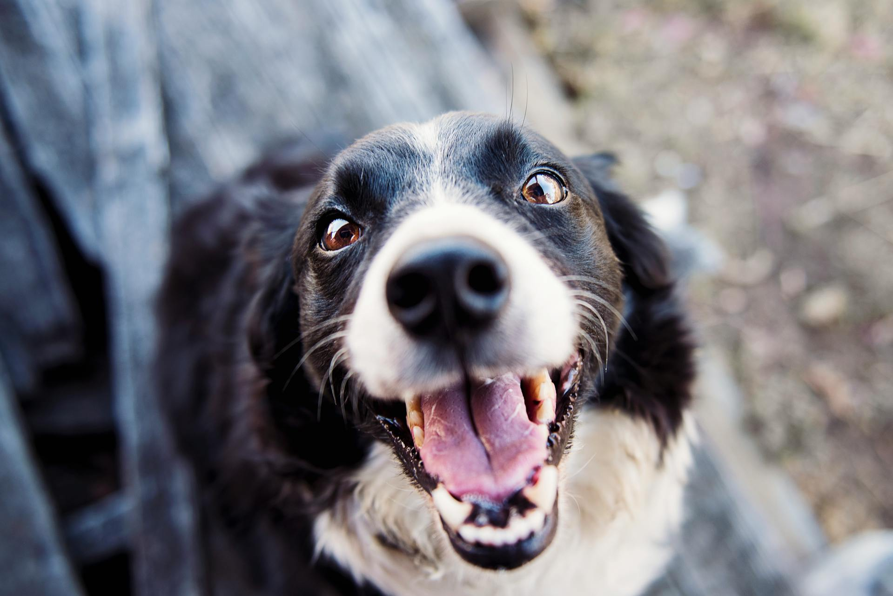
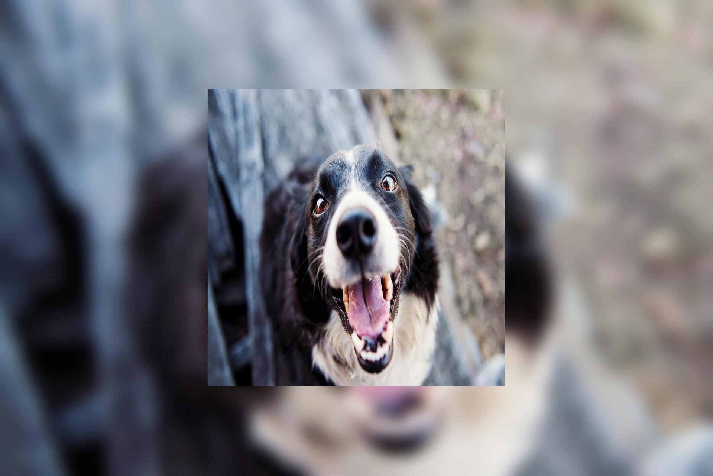
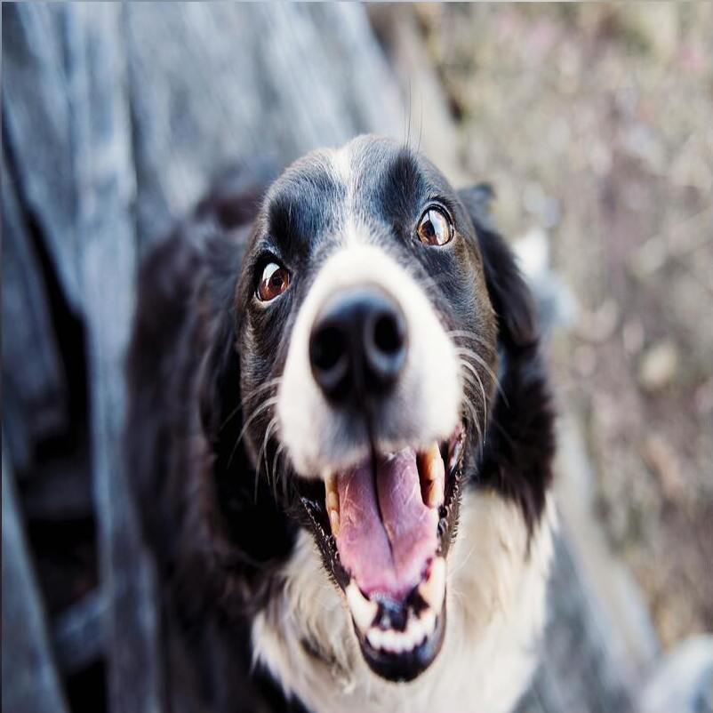

# Removing letterboxes and pillarboxes from images.

**Goal**: Given an image that is possibly letterboxed or pillarboxed (either by solid colors, or by blurred background), remove the letterboxing or pillarboxing and emit the cropped image to another file.

## Using [Image Magick](https://imagemagick.org/)

### Example

> [!NOTE]
>
> This example image has been obtained from [Photo by Kat Smith from Pexels](https://www.pexels.com/photo/shallow-focus-photography-of-adult-black-and-white-border-collie-551628/) and is free to use.

#### Original image [1919x1281] 160K



#### Letterboxed and Pillarboxed version [1919x1281] 111K



#### After detecting and removing the letterboxing and pillarboxing [802x802] 63K



### Solution

The following script assumes you have [Image Magick (v7+)](https://imagemagick.org/) and [ripgrep](https://github.com/BurntSushi/ripgrep) installed on your machine. You can store this file in your `/usr/local/bin/debox` and then run `sudo chmod +x /usr/local/bin/debox`. Admittedly, this script is not the fastest way to accomplish this but this is just a proof-of-concept that Image Magick can be used for this task.

#### Usage

```bash
debox image.jpg image-deboxed.jpg
```

This will write the letterbox/pillarbox-free version of `image.jpg` to `image-deboxed.jpg`.

#### Script

```bash
#!/usr/bin/env bash

# Date: 2024/05/02
# Author: Aalekh Patel (@aalekhpatel07)
# This script uses Image Magick to remove letterboxing and pillarboxing from images
# by detecting edge-free regions on the image using Canny edge detection.
#
# Usage: $ ./debox.sh foo-with-letterbox.jpg foo-output-letterbox-removed.jpg

set -euxo pipefail

INPUT_IMAGE="$1"
OUTPUT_IMAGE="$2"

echo "Removing letterboxing and pillarboxing from ${INPUT_IMAGE} and writing new image to ${OUTPUT_IMAGE}" >&2

TEMP_IMAGE_TXT="${INPUT_IMAGE%%.*}.tmp.txt"

# Write txt format of canny'd image to a temporary file.
convert ${INPUT_IMAGE} -canny 5x1+10%+20% ${TEMP_IMAGE_TXT}

HEIGHT=$(identify -ping -format "%h" ${INPUT_IMAGE})
WIDTH=$(identify -ping -format "%w" ${INPUT_IMAGE})

# These are populated by find_top_row, find_bottom_row, find_left_col, and find_right_col functions.
ZERO_ROW_FROM_TOP=0
ZERO_ROW_FROM_BOTTOM=$HEIGHT
ZERO_COL_FROM_LEFT=0
ZERO_COL_FROM_RIGHT=$WIDTH

function find_top_row() {
  # Find the largest block of rows from the top edge that is completely free of edges.
  for row in $(seq 0 $HEIGHT);
  do
    local NUM_ZEROS=$(rg "(\d+),${row}: \(0\)  #000000  gray\(0\)" --no-filename -c ${TEMP_IMAGE_TXT})
    # entire row is zeroes (i.e. no pixels are "edge"-y)
    if [[ "${NUM_ZEROS}" -eq ${WIDTH} ]]; then
      # extend the box downwards.
      if [[ "${ZERO_ROW_FROM_TOP}" -lt ${row} ]]; then 
        ZERO_ROW_FROM_TOP=${row}
      fi
    else
      break
    fi
  done
}


function find_bottom_row() {
  # Find the largest block of rows from the bottom edge that is completely free of edges.
  HEIGHT_MINUS_ONE=$(($HEIGHT-1))
  for row in $(seq $HEIGHT_MINUS_ONE -1 1);
  do
    local NUM_ZEROS=$(rg "(\d+),${row}: \(0\)  #000000  gray\(0\)" --no-filename -c ${TEMP_IMAGE_TXT})
    # entire row is zeroes (i.e. no pixels are "edge"-y)
    if [[ "${NUM_ZEROS}" -eq ${WIDTH} ]]; then
      # extend the box upwards.
      if [[ "${ZERO_ROW_FROM_BOTTOM}" -gt ${row} ]]; then 
        ZERO_ROW_FROM_BOTTOM=${row}
      fi
    else
      break
    fi
  done
}


function find_left_col() {
  # Find the largest block of columns from the left edge that is completely free of edges.
  for col in $(seq 0 $WIDTH);
  do
    NUM_ZEROS=$(rg "^${col},(\d+): \(0\)  #000000  gray\(0\)" --no-filename -c ${TEMP_IMAGE_TXT})
    # entire column is zeroes (i.e. no pixels are "edge"-y)
    if [[ "${NUM_ZEROS}" -eq ${HEIGHT} ]]; then
      # extend the box rightwards.
      if [[ "${ZERO_COL_FROM_LEFT}" -lt ${col} ]]; then 
        ZERO_COL_FROM_LEFT=${col}
      fi
    else
      break
    fi
  done
}


function find_right_col() {
  # Find the largest block of columns from the right edge that is completely free of edges.
  WIDTH_MINUS_ONE=$(($WIDTH-1))
  for col in $(seq $WIDTH_MINUS_ONE -1 1);
  do
    NUM_ZEROS=$(rg "^${col},(\d+): \(0\)  #000000  gray\(0\)" --no-filename -c ${TEMP_IMAGE_TXT})
    # entire column is zeroes (i.e. no pixels are "edge"-y)
    if [[ "${NUM_ZEROS}" -eq ${HEIGHT} ]]; then
      if [[ "${ZERO_COL_FROM_RIGHT}" -gt ${col} ]]; then 
      # extend the box leftwards.
        ZERO_COL_FROM_RIGHT=${col}
      fi
    else
      break
    fi
  done
}

CROPPED_WIDTH=
CROPPED_HEIGHT=

function debox() {
  # Determine the region of interest by chopping off the edge-free blocks.
  CROPPED_WIDTH=$(($ZERO_COL_FROM_RIGHT-$ZERO_COL_FROM_LEFT))
  CROPPED_HEIGHT=$(($ZERO_ROW_FROM_BOTTOM-$ZERO_ROW_FROM_TOP))
  CROPPED_ROW_OFFSET=$ZERO_ROW_FROM_TOP
  CROPPED_COL_OFFSET=$ZERO_COL_FROM_LEFT

  # Extract the region of interest.
  convert "${INPUT_IMAGE}"["${CROPPED_WIDTH}x${CROPPED_HEIGHT}+${CROPPED_COL_OFFSET}+${CROPPED_ROW_OFFSET}"] "${OUTPUT_IMAGE}"
}

find_top_row
find_bottom_row
find_left_col
find_right_col

# If the entire image is edge-free, then swap the left/right and top/bottom back
# since they would've effectively swapped places during the linear scan.
if [[ ${ZERO_ROW_FROM_TOP} -gt ${ZERO_ROW_FROM_BOTTOM} ]]; then
  ZERO_ROW_FROM_TOP_TMP=${ZERO_ROW_FROM_TOP}
  ZERO_ROW_FROM_TOP=${ZERO_ROW_FROM_BOTTOM}
  ZERO_ROW_FROM_BOTTOM=${ZERO_ROW_FROM_TOP_TMP}
fi
if [[ ${ZERO_COL_FROM_LEFT} -gt ${ZERO_COL_FROM_RIGHT} ]]; then
  ZERO_COL_FROM_LEFT_TMP=${ZERO_COL_FROM_LEFT}
  ZERO_COL_FROM_LEFT=${ZERO_COL_FROM_RIGHT}
  ZERO_COL_FROM_RIGHT=${ZERO_COL_FROM_LEFT_TMP}
fi

echo "top: ${ZERO_ROW_FROM_TOP} bottom: ${ZERO_ROW_FROM_BOTTOM} left: ${ZERO_COL_FROM_LEFT} right: ${ZERO_COL_FROM_RIGHT}" >&2

debox

echo "original: [${HEIGHT}x${WIDTH}] ${INPUT_IMAGE} -> de-letterboxed/pillarboxed: [${CROPPED_HEIGHT}x${CROPPED_WIDTH}] ${OUTPUT_IMAGE}" >&2

# Clean up the temporary txt representation
rm ${TEMP_IMAGE_TXT}

```

### Adding blurred letter/pillarbox to an existing image:

Given a source image called `image.jpeg`, take two copies of it, blur one of them (to serve as the background), and resize the other (to serve as the foreground), and then finally stack them at the center into a single image.

```sh
convert image.jpeg \
    \( -clone 0 -blur 0x20 \) \
    \( -clone 0 -resize 800x800\! \) \
    -delete 0 \
    -gravity center \
    -compose over \
    -composite \
    image-boxed.jpeg
```
